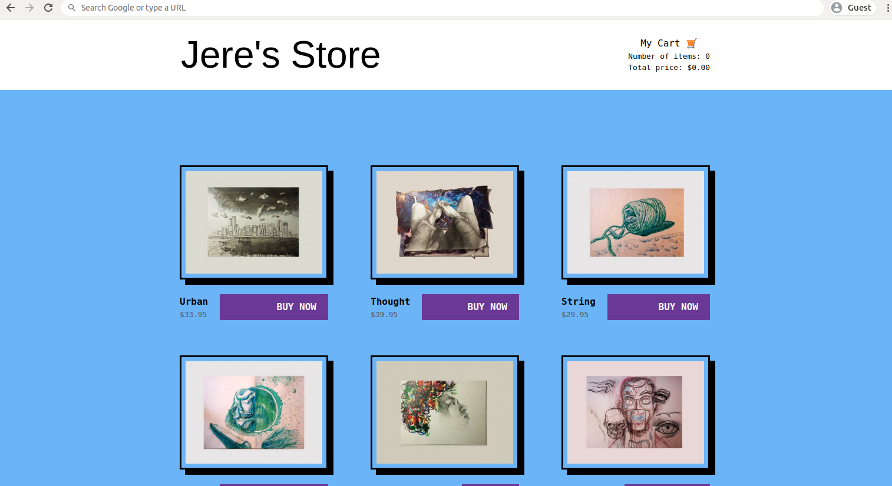

# Blazing E-commerce Site
This repo contains a static e-commerce site written with [GatsbyJS](https://www.gatsbyjs.org/), integrated with content coming from [DatoCMS](https://www.datocms.com/), utilizing a shopping cart created with [Snipcart](https://snipcart.com/), and deployed with [Netlify](https://www.netlify.com/)

## Repo Usage

 - Clone this project to your local machine 
 - In your terminal or command prompt, run `npm install` to get all of the packages from `package-lock.json`
 - Setup an account on [DatoCMS](https://www.datocms.com/)
 - 
 - Run `gatsby develop` and 

## About
